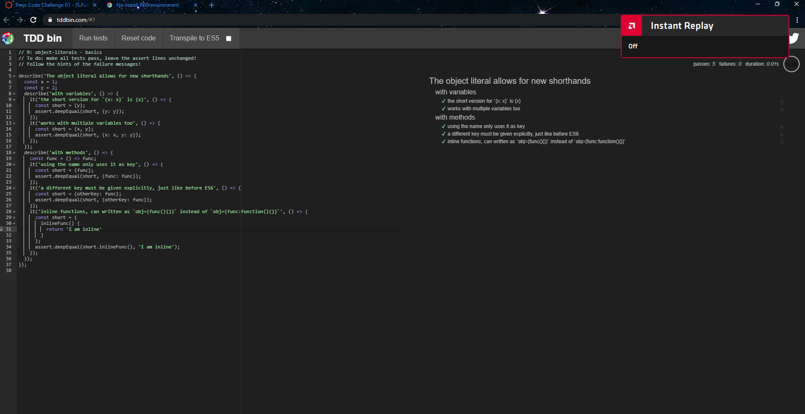
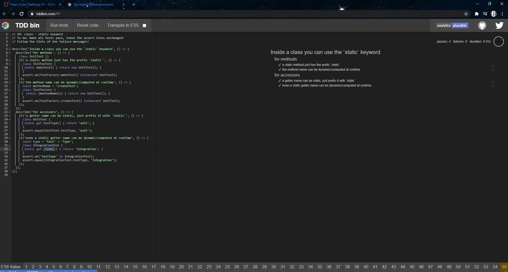

# This is the Code-Challenge-01-JS-Fundamentals

## Objects
An object is a list of properties that are used to describe its self. these properties can contain either primitive data or other objects.
### Code challenge 'Basic Tests'

### code challenge 'Computed Properties'

## Classes
Classes are "special functions", and just as you can define function expressions and function declarations, the class syntax has two components: class expressions and class declarations
### Code challenge 'Creation'

### Code challenge 'Statics'

### Code challenge 'Extends'

## Destructuring
Destructuring syntax is a JavaScript expression that makes it possible to unpack values from arrays, or properties from objects, into distinct variables.
### Code challenge 'Array Destructuring'

### Code challenge 'String Destructuring'

### Code challenge 'Object Destructuring'

## Code challenge 'Destructuring With Defaults'

### Code challenge 'Destructuring Function Parameters'

### Code challenge 'Destructuring with Alias'

## Rest
The rest parameter syntax allows us to represent an indefinite number of arguments as an array
### Code challenge 'Rest as a Parameter'

### Code challenge 'Rest While Destructuring'

## Spread
using spread allows an iterable(like an array or a string) to be expanded where function calls or elements are expected 
### Code challenge 'Array Spread'

## Function Defaults 
this allows functions to be used with default values if no value is passed or an undefined value is passed. 
### Code challenge 'Function Defaults'
![] (./screenshots/test14.png)

### -Justin Martin

